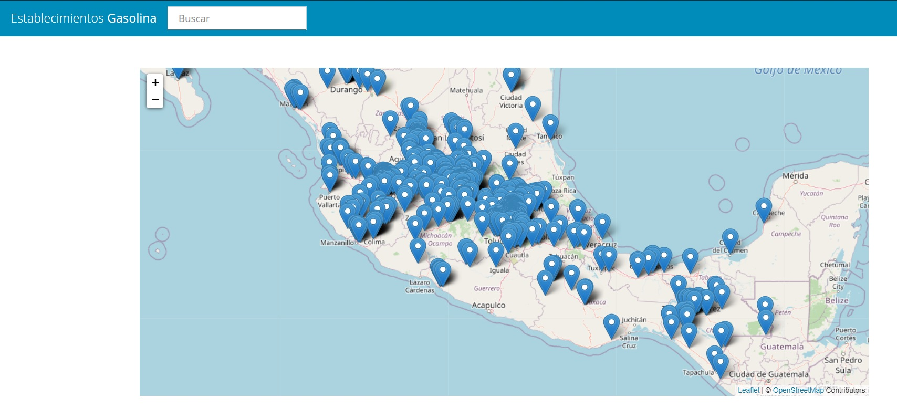

# Establecimientos en un Mapa con Leaflet

## Proyecto del curso de JavaScript de Juan Pablo De la torre

[Ver Curso](https://www.udemy.com/course/javascript-moderno-guia-definitiva-construye-10-proyectos/)



Url de la api

```
https://api.datos.gob.mx/v1/precio.gasolina.publico
```

Mapa [](https://leafletjs.com/)
https://leafletjs.com/
